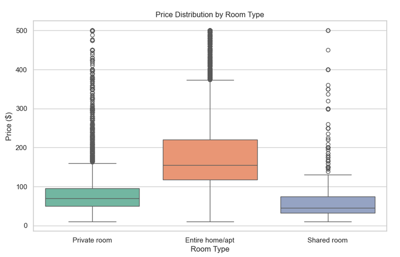
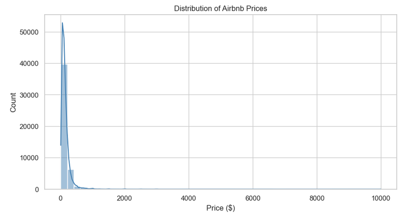
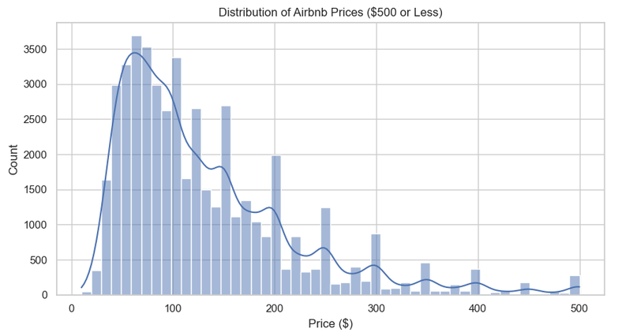
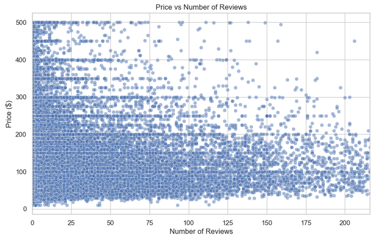
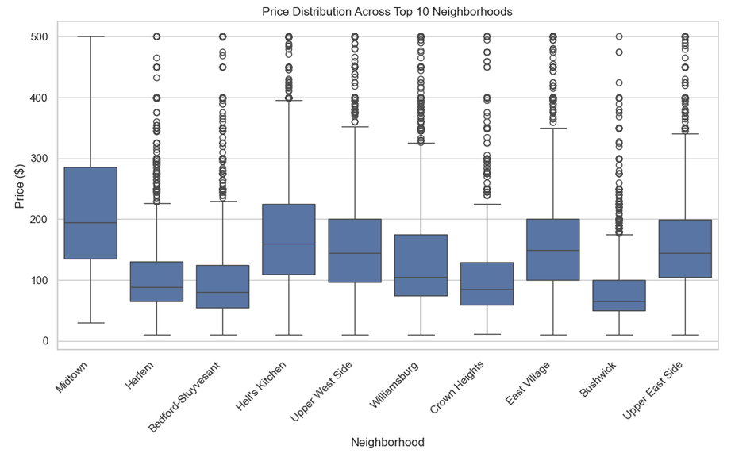

# New York City Airbnb Listing Analysis



## Project Overview

This project uses exploratory data analysis and visualization to examine Airbnb listing prices in New York City. The analysis evaluates how prices vary by room type and neighborhood and explores whether listing price is associated with review activity.

The project demonstrates data preparation, exploratory analysis, visualization, and responsible interpretation using Python and Jupyter Notebook.

## Questions Examined

The analysis addresses four questions:

* What is the distribution of Airbnb listing prices?
* How do prices vary among room types?
* Is there a relationship between listing price and number of reviews?
* How do price distributions vary among neighborhoods with the most listings?

## Dataset

The project uses the New York City Airbnb Open Data dataset, which contains 48,895 listings and 16 original variables from 2019.

The dataset includes:

* Listing and host identifiers
* Borough and neighborhood
* Latitude and longitude
* Room type
* Nightly price
* Minimum-night requirement
* Number of reviews
* Reviews per month
* Annual availability

[View the dataset on Kaggle](https://www.kaggle.com/datasets/dgomonov/new-york-city-airbnb-open-data)

## Analysis Process

The analysis was completed in Python using a Jupyter Notebook. The process included:

1. Loading and inspecting the dataset.
2. Reviewing its dimensions, fields, data types, and missing values.
3. Checking for duplicate listing identifiers.
4. Selecting variables relevant to the research questions.
5. Removing missing, zero, and negative price observations.
6. Examining the complete price distribution.
7. Creating a separate dataset limited to listings priced at $500 or less for clearer visual comparisons.
8. Comparing price distributions by room type.
9. Examining the relationship between price and number of reviews.
10. Comparing prices across the ten neighborhoods with the most listings.

The original cleaned dataset is preserved separately from the trimmed dataset used for selected visualizations.

## Principal Findings

* The price distribution is strongly right-skewed, with most listings concentrated in the lower and middle portions of the observed price range.
* Most listings in the trimmed visualization are priced between approximately $50 and $150.
* Entire homes and apartments have higher median prices and greater price variability than private and shared rooms.
* Shared rooms have the lowest median price among the three room types.
* Price and accumulated review count display no clear linear pattern, although the visualization suggests a weak negative association.
* Median prices and price variability differ among the ten neighborhoods with the most listings.
* The visualizations identify associations but do not establish that room type, neighborhood, or review activity causes a listing’s price.

## Visualizations

### Price distribution



The complete price distribution contains a long right tail created by a comparatively small number of high-priced listings.

### Price distribution - $500 or less



This visualization temporarily excludes listings priced above $500 to make the typical price distribution easier to examine.

### Price by room type


Entire homes and apartments have the highest median price and widest price distribution.

### Price and number of reviews



The scatterplot shows no clear linear pattern between listing price and accumulated review count.

### Prices across the top ten neighborhoods



Price distributions differ among the ten neighborhoods containing the most listings, although the analysis does not determine the causes of those differences.

## Technologies

* Python
* Jupyter Notebook
* pandas
* Matplotlib
* Seaborn

## Repository Contents

| Folder     | Contents                                                                  |
| ---------- | ------------------------------------------------------------------------- |
| `analysis` | Jupyter Notebook containing the analysis, explanations, and saved outputs |
| `data`     | New York City Airbnb dataset used in the analysis                         |
| `images`   | Visualizations used for the repository preview                            |

## Project Materials

* [View the complete Jupyter Notebook](analysis/Airbnb_Analysis.ipynb)
* [View the source dataset](data/AB_NYC_2019.csv)

## Running the Analysis

### Requirements

Install Python 3 and the required packages:

```bash
pip install pandas matplotlib seaborn jupyter
```

Clone the repository:

```bash
git clone https://github.com/ferrillt/Airbnb-Analysis.git
```

Move into the notebook folder:

```bash
cd Airbnb-Analysis/analysis
```

Start Jupyter Notebook and open the analysis:

```bash
jupyter notebook Airbnb_Analysis.ipynb
```

Run the notebook cells in order. The notebook reads `AB_NYC_2019.csv` from the adjacent `data` folder.

## Assumptions and Limitations

* The dataset represents New York City Airbnb listings from 2019 and should not be interpreted as current market information.
* Listings with missing, zero, or negative prices were excluded.
* Listings priced above $500 were temporarily excluded from selected visualizations but were retained in the cleaned dataset.
* The `$500` threshold was selected to make the principal price distribution easier to examine; it is not a statistical definition of an outlier.
* Number of reviews does not directly measure bookings, occupancy, customer satisfaction, or current demand.
* Availability does not necessarily represent actual vacancies because hosts can block dates for reasons unrelated to bookings.
* The analysis does not account for property size, amenities, listing quality, seasonal demand, or local events.
* Neighborhood comparisons are limited to the ten neighborhoods with the most listings in the trimmed dataset.
* Observed relationships are descriptive and do not establish causation.
* Affordability cannot be determined without information about traveler budgets or income.

## Ethical Considerations

The project uses publicly available listing data and does not attempt to identify individual hosts or guests. Results are presented as aggregate descriptive patterns. The analysis avoids treating review counts as confirmed occupancy and does not attribute price differences to neighborhood characteristics that were not directly evaluated.

## Potential Enhancements

Future work could:

* Calculate correlation statistics for the numerical variables.
* Compare prices across New York City boroughs.
* Examine seasonal or time-based pricing patterns using newer data.
* Evaluate the relationship between price and minimum-night requirements.
* Analyze review activity and availability by room type and neighborhood.
* Develop a predictive model for estimating listing prices.
* Use clustering to identify groups of listings with similar characteristics.
* Create an interactive dashboard or geographic map.

## Author

Teresa Ferrill
